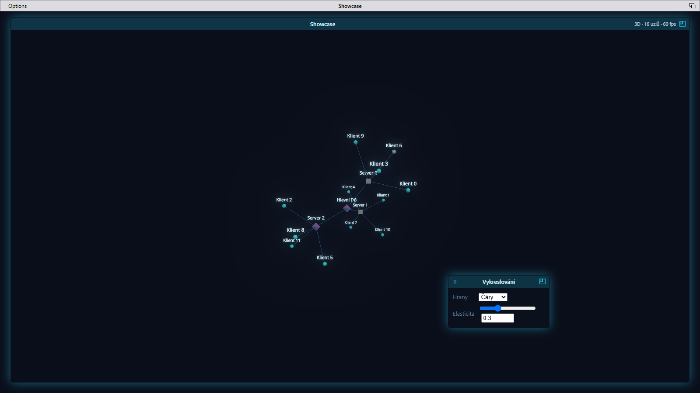

# viewbase

**Živá 2D/3D force-graph vizualizace ovládaná z Pythonu.**

Knihovna, kterou i junior v Pythonu postaví interaktivní vizualizaci vztahů
(graf) v ploše nebo prostoru — bez psaní JavaScriptu, bez npm, bez znalosti
Three.js. Python je zdroj pravdy pro *data, vzhled a chování*; prohlížeč počítá
*rozmístění* (fyzika běží lokálně) a vykresluje. Díky tomu je obraz plynulý a
knihovna zvládá tisíce až desítky tisíc uzlů.



```python
import viewbase as vb

canvas = vb.Canvas(title="Ahoj graf", dimensions=3)
canvas.add_node("a", name="Alfa")
canvas.add_node("b", name="Beta")
canvas.add_edge("a", "b")

vb.serve(canvas, open_browser=True)   # otevře prohlížeč, graf se sám usadí
```

---

## Proč to takhle

Klasická úskalí force-graph vizualizací (škubání, strop pár stovek uzlů) plynou
z toho, že fyzika běží na serveru a klient dostává snapshoty po síti. viewbase to
obrací:

- **Fyzika běží v prohlížeči** ve Web Workeru (d3-force-3d, Barnes-Hut
  *O(n log n)*) — obraz je plynulý na 60 fps, pozice uzlů po síti vůbec
  necestují.
- **Instancovaný rendering** (Three.js `InstancedMesh`) — počet draw callů
  nezávisí na počtu uzlů; popisky jsou SDF text ve WebGL s LOD rozpočtem.
- **Server posílá jen delty** (přidej/změň/odeber uzel·hranu, akce) přes
  WebSocket; graf se může za běhu průběžně přestavovat.

Naměřeno (Apple M4 Pro, headless Chromium): **3 000 uzlů ~120 fps**,
**10 000 uzlů ~86 fps**.

---

## Instalace a spuštění

```bash
pip install viewbase
python examples/quickstart.py     # otevře http://127.0.0.1:8080
```

Balíček nese už sestavený frontend — **Node.js není potřeba**. Publikaci na
PyPI dělá release pipeline při tagu `v*` (do prvního release nainstaluj
z repa podle sekce níže). **Požadavky:** Python ≥ 3.10.

<details>
<summary>Vývoj knihovny z repa (vyžaduje Node.js ≥ 20)</summary>

```bash
git clone <repo> && cd viewBase
python -m venv .venv && source .venv/bin/activate
pip install -e "python[dev]"

# jednorázové sestavení frontendu do python/viewbase/static
(cd frontend && npm install && npm run build)
```

</details>

---

## Ukázky

Spustitelné příklady jsou živá dokumentace — viz tabulka v sekci
[Dokumentace](#dokumentace). Pár výřezů:

### Control okno: vzhled grafu řízený z backendu

Backend definuje **parametrické okno** (typovaná pole int/number/string/enum/
bool); hodnoty tečou zpět tlačítkem *Použít*, nebo průběžně při každé změně
(`live=True`), a backend podle nich řídí graf.
Tady přepíná hrany mezi **čarami** a **splajny** (bezier) a jejich elasticitu —
týž graf, jen přepnutý přepínač:

| Čáry | Splajny |
|---|---|
|  |  |

### 2D ortografický režim

`Canvas(dimensions=2)` přepne na 2D s pan/zoom:


---

## Klíčové koncepty

Vše se točí kolem objektu `Canvas`. Po nastavení grafu zavoláš `vb.serve(canvas)`,
což spustí server a zablokuje; živá data pak řeší `@canvas.every()` úlohy a
event handlery (žádný threading v uživatelském kódu; Canvas je thread-safe).
V REPL/Jupyteru použij `vb.serve(canvas, block=False)` — vrátí handle
s `.port` a `.stop()` a prompt zůstane volný.

```python
canvas = vb.Canvas(title="Infrastruktura", dimensions=3, theme="cyber",
                   highlight_neighbors=1, quality="auto")

# uzly a hrany (+ libovolná metadata; živé změny kdykoli za běhu)
canvas.add_node("srv-1", type="server", name="Web 01", ip="10.0.0.5")
canvas.add_edge("srv-1", "db-1")
canvas.update_node("srv-1", status="down")     # popisek se přepočte
canvas.update_node("srv-1", color="#ff2a6d")   # živá barva jednoho uzlu
canvas.update_node("srv-1", type="db")         # živá změna typu (barva/tvar/velikost)
canvas.ensure_node("srv-1", status="up")       # upsert: založ, nebo slouč meta
canvas.remove_edge("srv-1", "db-1")            # mazání za běhu
canvas.remove_node("srv-1")                    # uzel + jeho hrany (kaskáda)
with canvas.batch():                            # hromadné delty = jedna zpráva
    ...

canvas.node_label("{name} ({ip})")              # šablona popisku z meta klíčů
canvas.define_type("server", shape="box", color="#28d7fe", size=1.4)

canvas.node("srv-1")["meta"]["ip"]              # čtení stavu (i v handlerech)

@canvas.every(2.0)                              # periodická úloha knihovny
def tick():
    canvas.ensure_node("beat", ts="now")
```

- **Typy uzlů a témata** — `define_type` (tvary `sphere`/`box`/`octahedron`/
  `tetrahedron`); vestavěná témata `modern`/`cyber`/`workbench` (viz sekce
  „Ve vývoji" níže) nebo vlastní dict.
- **Živá změna vzhledu uzlu** (uzel se kvůli ní neodebírá ani nezakládá – drží
  si pozici i hrany): priorita **meta > typ > téma**.
  `update_node(id, color="#ff2a6d")` přebarví jeden uzel (`size=` totéž),
  `color=None` ho vrátí na typ/téma; `update_node(id, type="db")` přepne typ
  (barva, tvar i velikost), `type=None` typ zruší, nezadaný `type` ho nechá být;
  `define_type("db", color="#ffd166", …)` za běhu přebarví **všechny** uzly
  toho typu (styl se nahrazuje celý).
- **Eventy** (prohlížeč → Python) — `@canvas.on_click` / `on_hover` /
  `on_background_click` / `on_view_change`; běží v thread-poolu. Vlastní event
  registruje `canvas.on("jmeno", handler)` a poslat ho jde i zvenčí přes REST
  `POST /api/event` (`{"event": …, "payload": {…}}`) — most pro cron, jiný
  proces nebo `curl`.
- **Akce** (Python → prohlížeč) — `focus`, `highlight`, `show_detail`,
  `set_theme`, `set_edge_style("line"|"spline", elasticity=…)`.
- **Detailní okno** — `detail_window(rows=…)`; klik na uzel otevře tažitelné
  okno s metadaty (styl Amiga Workbench, dok, z-order).
- **Okna se dají zvětšovat** — každé okno (detail, control i terminál) má
  úchyt v pravém a levém dolním rohu: najetím myší se objeví mírně průhledný
  čtvereček, tažením za něj se okno zvětší nebo zmenší (levý roh hýbe levou
  hranou, pravá stojí). Pozice **i velikost** oken se pamatují v prohlížeči
  (localStorage, klíč `vb-pos:<window_id>`), takže přežijí obnovení stránky.
- **Toky** — `define_flow_type` + `flow(src, dst | path=[…], type=…)`: světelné
  částice po hranách (pakety, zprávy, provoz); `count=None` je trvalý tok
  (vrací `flow_id`, zastaví ho `stop_flow(flow_id)`; smazání hrany na cestě
  ho zruší samo).
- **Control okna** — `ControlWindow` (pole `integer`/`number`/`string`/`enum`/
  `boolean`) + `open_window(win, on_submit=…, live=…)`: backendem řízený
  parametrický dialog; `live=True` posílá hodnoty při každé změně (slider bez
  tlačítka *Použít*). Zavírá `close_window(window_id)`.
- **Terminálová okna** — `TerminalWindow` + `open_terminal(win, on_input=…)`:
  konzole v prohlížeči, kterou obsluhuje Python. Řádek od uživatele přijde do
  handleru jako `event.line`, server píše zpátky `terminal_write(window_id,
  text)`; `TerminalWindow(…, input=False)` je jen výstupní panel (živý log).
- **Idempotentní zápis a čtení** — `ensure_node`/`ensure_edge` (upsert pro živé
  zdroje dat), `has_node`/`has_edge`, `node()`/`edge()`, `canvas.nodes`/`edges`.
- **Import grafů** — `Canvas.from_networkx(G)` / `canvas.add_graph(G,
  type_attr=…)` (duck-typing, networkx není závislost), `add_edges(pairs)`.
- **Periodické úlohy a REPL** — `@canvas.every(sekundy)` místo vlastních
  vláken; `vb.serve(canvas, block=False)` vrací `ServerHandle` (`.port`,
  `.stop()`, context manager).

Detaily API a chování viz návrhové dokumenty a příklady níže.

### 🚧 Ve vývoji: multi-screen Workbench

Připravuje se Amiga-style **`Screen`** — kontejner nad `Canvas` (víc živých
grafů najednou, hloubkový stack, drag-reveal, vestavěné log okno,
Options menu řízené divákem). Backend už to reálně umí:

```python
screen_a = vb.Screen(title="Síť")       # id se přidělí samo (1, 2, …)
canvas_a = vb.Canvas(screen=screen_a)
screen_b = vb.Screen(title="Infra")
canvas_b = vb.Canvas(screen=screen_b)
vb.serve(canvas_a, canvas_b, open_browser=True)   # jeden server, dva canvasy
```

Server multiplexuje `init`/patch/akce podle `screen_id` na jednom WS
spojení a `vb.log(message, level=…)` teče do prohlížeče jako zpráva `log`.

Frontend je architektonicky **window manager s pluginy**: jádro
(`frontend/src/wm/`) umí screeny, okna, lištu a Options — a vůbec neví, co
okna zobrazují. Každá schopnost je **plugin** (`frontend/src/plugins/`):
vlastní typ okna + vlastní Options + vlastní server akce. **Zobrazení
grafu je jen jedna z těchto schopností** (`plugins/graph/` — WebGL
pipeline, fyzika, picking), stejné váhy jako log konzole, detailní okna
uzlů, formulářová (control) a terminálová okna. Přidání nové schopnosti =
nový plugin, žádný zásah do jádra. Detaily v
[architektonické revizi](docs/superpowers/specs/2026-08-02-wm-plugin-architecture.md).

Screen je prázdný desktop a všechno na něm jsou okna. **Graf žije v okně**
(velké, s odsazením od krajů; jde přesouvat, zmenšovat za rohové úchyty,
minimalizovat do doku i **maximalizovat dvojklikem na lištu** — geometrie
se pamatuje v `localStorage`; v liště okna běží živé info o síti
„2D/3D · N uzlů · M fps") a **log je taky okno**: na první `log` zprávu se
samo otevře okno **„Log"** na předním screenu — `tail -f` v okně ve stylu
AmigaShell (nové řádky dolů, autoscroll na poslední, každý řádek s
timestampem). Jako AmigaShell nemá zavírací gadget (`closable: false`) —
jde jen minimalizovat do doku, takže se divákovi nikdy neztratí.

Na liště každého screenu je vestavěná skupina **„Options"** (view-only,
žádné Python volání ji nezakládá; je vždy první skupina, `ScreenMenu`
skupiny za ní) a její obsah řídí **aktivní okno** — stejný model jako macOS
menu bar, kde menu patří aktivní aplikaci: klik na okno grafu → „Fyzika
běží", „Křivkové hrany (splajn)", **„3D pohled"** (živé přepnutí kamery i
fyzikální simulace 2D/3D za běhu; volba se pamatuje v `localStorage` napříč
reconnecty); klik na okno logu → filtry úrovní (debug/info/warning/error)
a zdrojů. Okna bez vlastních Options (detail, control, terminál) skupinu
nemění; volba položky (i checkbox) dropdown hned zavře. A pokud něco na
frontendu spadne (neodchycená JS chyba), spojení vypadne, nebo backend
zaloguje `level="error"`, objeví se **Guru Meditation** — homage na Amiga
crash obrazovku (červeně orámovaný blikající box, zavírá se libovolným
tlačítkem myši nebo Esc — ne jen levým, na Macu nedává smysl), ne tichý
`console.error`. Místo původního hex kódu nese box **skutečný důvod
chyby** („Spojení se serverem vypadlo…", text výjimky) — je to vývojářský
nástroj, důvod je užitečnější než hash.

Nové je i vestavěné téma **`"workbench"`** (`Canvas(theme="workbench")`)
— přebarví okna do Amiga/AmigaDOS palety: bílá titulková lišta s jemným
vodorovným pruhováním, syté modré tělo okna s bílým monospace textem,
oranžové akcenty (chrome only; barvy uzlů/hran zůstávají `modern`, to řídí
vývojář přes `define_type`, ne téma). Gadgety oken (zavřít/minimalizovat/
obnovit) i přepínač screenů na liště jsou **bitmapy vyříznuté z originálních
Workbench screenshotů** (`docs/images/workbench-ref/`), ne unicode glyfy.
Témata jsou per-screen (CSS proměnné na kontejneru screenu, ne globální) —
dva screeny s různými tématy si okna nepřebarvují navzájem.

A taky vestavěné **`ScreenMenu`** (§8 designu) — pull-down menu, co si
vývojář sám naplní. `Screen.pin_menu(menu)` funguje nezávisle na tom, jestli
`Canvas` už existuje — Screen a Canvas jsou explicitně nezávislé, atomické
objekty, ne implicitně provázaná dvojice. V prohlížeči se objeví lišta se
skupinami nahoře na screenu (`Options` je na ní vždy první skupina); klik
na skupinu rozbalí dropdown (světle šedý, tvrdý okraj — podle Workbench
reference), klik na položku zavolá `on_select` na serveru a menu přežije
reconnect. Kompletní příklad (menu naplněné před vznikem Canvasu):
`examples/screen_menu.py`.

Frontend teď víc `Canvas` instancí (`screen=` na obou) i **vizuálně**
zvládá — každý screen má **právě jednu lištu** od kraje ke kraji (Options +
`ScreenMenu` skupiny vlevo, vystředěný titulek, vpravo jediný depth
gadget, přesně podle Workbench reference; info o síti nese lišta okna
grafu, ne lišta screenu) a
vlastní graf, téma i okna. Depth gadget prohodí přední/zadní screen; navíc
jde přední screen **tahem myší za lištu** stáhnout dolů a odkrýt ten pod
ním — přesně jako na Amize (mapování bitmapa→scanline: celý screen se
posouvá jako jeden blok, obsah se nemění). Tažení je perzistentní jako u
oken: kam lištu dotáhneš, tam předěl zůstane (žádný snap-back), druhé
tažení navazuje, gadget vrací čistý stav. Každý screen má vlastní trvalý
offset. Screeny mimo první dvě pozice v hloubkovém pořadí se úplně
pozastaví — **nejen vykreslování, i fyzika** — aby nežraly prostředky na
pozadí. `Screen.destroy()` je explicitní protějšek k vytvoření — zavře
přidružený `Canvas` a frontend uklidí kompletně (WebGL kontext, physics
worker, DOM), žádné přízraky po smazaném screenu. Kompletní příklad (dva
screeny, drag-reveal, `destroy()` přes REST): `examples/multiscreen.py`.

(`title=` je zatím potřeba nastavit na obou — `Screen.title` je titulek
lišty screenu, `Canvas.title` titulek okna grafu.)

Dnešní jednoscreenové použití (`vb.Canvas(dimensions=…)`,
`vb.serve(canvas)`, bez `screen=`) funguje beze změny a je to, co používají
všechny ostatní příklady v tabulce níže. Zbytek `workbench` chrome přijde
v dalších fázích — viz
[design](docs/superpowers/specs/2026-08-02-multi-screen-workbench-design.md)
a [implementační plán](docs/superpowers/plans/2026-08-02-multi-screen-workbench-plan.md).

---

## Dokumentace

**Spustitelné příklady** (`examples/`) — nejlepší živá reference:

| Soubor | Co ukazuje |
|---|---|
| `examples/quickstart.py` | minimální živý graf (3D) |
| `examples/quickstart2d.py` | 2D ortografický režim |
| `examples/interactive.py` | klik → rozbalení sousedů (eventy/akce) |
| `examples/prototype.py` | `ControlWindow` jako **formulářový dialog** (přidání uzlu podle zadaných polí), `TerminalWindow` jako log |
| `examples/showcase.py` | téma cyber, typy uzlů, **živá změna barvy/typu za běhu**, toky, **control okno** (čáry/splajny) |
| `examples/terminal.py` | **konzole v prohlížeči**: `TerminalWindow`, `on_input`, `terminal_write`, výstupní panel a REST push (`/api/event`) |
| `examples/words.py` | mapa slov z Wikipedie (crawl odkazů) |
| `examples/stress.py` | zátěžový test (tisíce uzlů) |
| `examples/log_demo.py` | **multi-screen Workbench**: `vb.log()` → vestavěné okno „Log" (`tail -f` styl AmigaShell, timestampy), Options aktivního okna na liště (graf: fyzika/splajn/3D; log: filtry úrovní a zdrojů) |
| `examples/screen_menu.py` | **multi-screen Workbench**: `ScreenMenu` (autorské pull-down menu), `Screen.pin_menu()` volané před vznikem Canvasu |
| `examples/multiscreen.py` | **multi-screen Workbench**: dva `Screen`/`Canvas` s tab přepínačem a drag-reveal, explicitní `Screen.destroy()` přes REST |
| [`examples/wireshark/`](examples/wireshark/README.md) | **síťové toky**: přehrání pcap, živý odposlech a cesta paketu (traceroute) |

**Návrhové dokumenty** (`docs/superpowers/specs/`) — architektura a rozhodnutí:

- [Návrh knihovny (architektura, protokol, fyzika, rendering)](docs/superpowers/specs/2026-06-10-viewbase-library-design.md)
- [Detailní okno](docs/superpowers/specs/2026-06-14-detail-window-design.md)
- [Traceroute toky (routery jako uzly, multi-hop)](docs/superpowers/specs/2026-06-16-traceroute-toky-design.md)
- [Control okna (parametrické GUI) + křivkové hrany](docs/superpowers/specs/2026-06-17-control-okna-design.md)
- [Multi-screen Workbench (Amiga-style, ve vývoji)](docs/superpowers/specs/2026-08-02-multi-screen-workbench-design.md)

Implementační plány (krok za krokem) jsou v
[`docs/superpowers/plans/`](docs/superpowers/plans/).

---

## Architektura

```
Python skript (Canvas API)
        │  data + metadata + vzhled + chování
viewbase (pip balíček: GraphModel, FastAPI + WebSocket, zabalený frontend)
        │  ↓ delty + akce          ↑ eventy (klik, hover, kamera, control okna)
Browser (viewbase.js)
        ├─ GraphStore  – jediné zrcadlo stavu
        ├─ PhysicsWorker – d3-force-3d (Barnes-Hut, 2D/3D)
        └─ Renderer – Three.js instancing, témata, SDF labely, toky, okna
```

### Struktura repozitáře

```
python/viewbase/      pip balíček (canvas, controls, server, protocol, static/)
frontend/             zdrojáky JS (Vite) – build → static/
examples/             spustitelné ukázky = živá dokumentace
docs/superpowers/     návrhové specifikace a plány
docs/images/          screenshoty pro README
legacy/               původní prototyp (referenční)
```

---

## Vývoj

```bash
pip install -e "python[dev]"
cd python && python -m pytest -q          # backend testy
cd frontend && npm install && npm test    # frontend testy (vitest)
cd frontend && npm run build              # sestaví static/ pro balíček
```

Frontend se vyvíjí s Vite/npm, ale výstup buildu se zabalí do Python balíčku —
koncový uživatel npm nepotřebuje.

---

## Stav

Funkční jádro: živý 2D/3D graf, typy uzlů, témata (modern/cyber), SDF popisky,
bloom, quality=auto, eventy/akce, zvýraznění sousedů, detailní okno, toky a typy
toků, wireshark příklady (pcap, živý odposlech, traceroute), control okna
(parametrické GUI), terminálová okna (konzole + REST push) a křivkové hrany
(čáry/splajny + elasticita), **živá změna vzhledu uzlu za běhu (barva/velikost
přes meta, přepnutí typu, redefinice typu)**. Rozpracováno: multi-screen
Workbench — backend (`Screen`, `vb.log`, multi-canvas `serve()`/protokol
routing podle `screen_id`) hotový a otestovaný, frontend (vizuální
přepínač, compositor, `workbench` chrome) zatím ne — viz sekce výše.
Plánováno dále: GLB modely uzlů, distribuce přes wheel + CI, IPv6 v živém
odposlechu.
