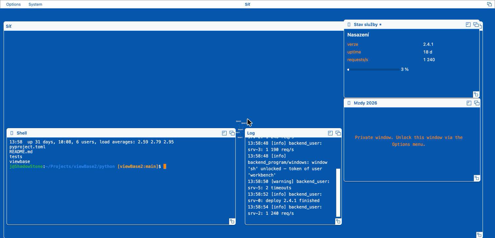
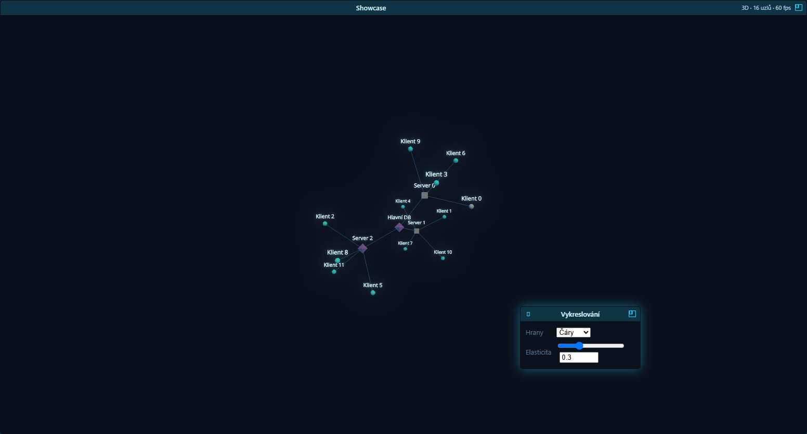
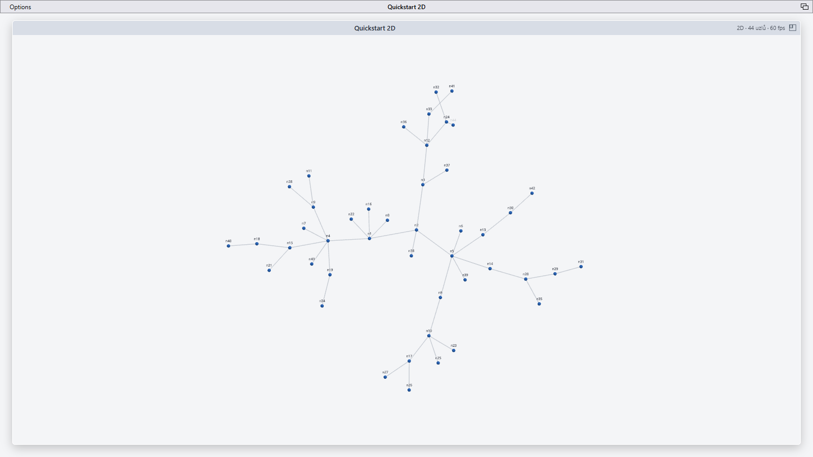

# Ukázky

*Screenshoty ze živého běhu a odkazy na spustitelné příklady.*

[← zpět na přehled](../README.md)

---

# Ukázky

Spustitelné příklady jsou živá dokumentace — viz tabulka v sekci
[Veřejné API a příklady](api.md). Pár výřezů:

### Celý workbench

Screeny, okna, živý graf, log a **skutečný shell na PTY** — všechno z Pythonu,
tady v tématu `workbench-amiga`:

Hlášky knihovny v log okně jsou **anglicky** (jako všechny texty workbenche) a
nesou auditní stopu zámků — `window 'sh' unlocked – token of user 'workbench'`.
Řádky, které do logu píše vaše aplikace (`vb.log(...)`), jsou samozřejmě vaše.

### Control okno: vzhled grafu řízený z backendu

Backend definuje **parametrické okno** (typovaná pole int/number/string/enum/
bool); hodnoty tečou zpět tlačítkem *Použít*, nebo průběžně při každé změně
(`live=True`), a backend podle nich řídí graf.
Tady přepíná hrany mezi **čarami** a **splajny** (bezier) a jejich elasticitu —
týž graf, jen přepnutý přepínač:

| Čáry | Splajny |
|---|---|
|  |  |

### 2D ortografický režim

`GraphWindow(dimensions=2)` přepne na 2D s pan/zoom:

### Zabezpečené okno: obsah až po kódu z autentikátoru

`private=True` udělá z okna **privátní okno**: server pošle jen prázdný rám,
obsah po drátě neputuje. Nic nevyskakuje — o kód si divák řekne sám z lišty:

| Aktivní privátní okno → `Options` | Výzva ve stylu Guru Meditation |
|---|---|
|  |  |

Odemčené zabezpečené okno má v `Options` symetricky **`Lock Window`** — obsah
se zase schová a příště si okno řekne o kód znovu.

---

---

[← zpět na přehled](../README.md)
